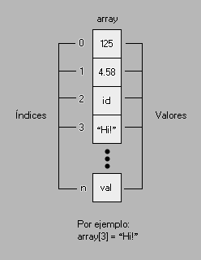
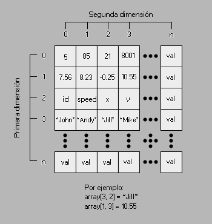

# Anexo: Arreglos

En esta página encontrarás información adicional acerca de los arreglos y sus propiedades más importantes.  
  
Un arreglo es un tipo de dato especial que permite almacenar más de un dato dentro de sí, relacionados con un identificador denominado índice.  El índice es un valor numérico **natural** (entero positivo) que puede ir de 0 a 32000. Cada índice puede almacenar información indepentiende como números o cadenas de texto.  
  
Existen dos tipos de arreglos: Los arreglos unidimensionales y los arreglos bidimensionales.  

## Arreglos unidimensionales

Los arreglos unidimensionales tienen forma lineal, como una lista de elementos escritos en secuencia.  
  



  
La anterior imagen muestra gráficamente la estructura de un arreglo unidimensional, que se divide en dos partes: La variable en la que se almacena y el índice, que se escribe entre corchetes. Por ejemplo:  
  
```gml  
mi_arreglo[0] = 128;  
mi_arreglo[1] = 0.5;  
mi_arreglo[2] = "Resultado: ";  
  
result = mi_arreglo[2] + string(mi_arreglo[0] * mi_arreglo[1]);  
//result = "Resultado: 64"  
  
```  
Como se puede apreciar, los arreglos pueden ser utilizados como variables comunes.  
  
Cabe aclarar que cuando se dejan índices intermedios sin declarar (_ej: declarar 1 y 3, pero no 0 ni 2_), éstos tomarán el valor de 0. Por ejemplo:  
  
```gml  
datos[5] = "Dato 5";  
datos[7] = "Dato 7";  
/*  
dato[0] = 0  
dato[1] = 0  
dato[2] = 0  
dato[3] = 0  
dato[4] = 0  
dato[5] = "Dato 5"  
dato[6] = 0  
dato[7] = "Dato 7  
*/  
  
```  

## Arreglos bidimensionales

Los arreglos bidimensionales tienen forma de cuadrícula, donde a cada índice de la primera dimensión le corresponde un índice en la segunda, ubicando los valores gracias a esta pareja de índice que podrían tomarse como las coordenadas en la cuadrícula.  
  



  
Como se puede apreciar en la imagen, un arreglo bidimensional se define por una pareja de índices separados por comas, donde el primer índice corresponde a la ubicación del valor en la primera dimensión, y el segundo, la ubicación en la segunda. Por ejemplo:  
  
```gml  
tabla[0, 0] = 10;  
tabla[0, 1] = 25;  
tabla[0, 2] = "Jelou";  
  
tabla[1, 0] = -222;  
tabla[1, 1] = false;  
tabla[1, 2] = irandom(34);  
table[1, 3] = instance_create(x, y, objeto);  
  
```  
Como se puede ver en el ejemplo, la segunda dimensión de cada primera dimensión puede tener tamaños distintos.