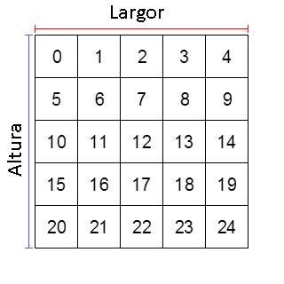

# array_height_2d

Devuelve la cantidad de elementos de la primera dimensión de un array bidimensional.

## Sintaxis

  
```gml  
array_height_2d(val);  
```  

## Argumentos

Argumento|Descripción|  
---|---|  
val|El _array_ a revisar.|  

## Descripción

Un array bidimensional posee, generalmente, esta estructura:  
  
  
  
Esta función devuelve la cantidad de elementos que componen la primera dimensión (altura) de un array bidimensional, que, en la imagen de ejemplo, equivaldría a 5.

## Devuelve

Número entero.

## Ejemplo

  
```gml  
a[0, 0] = 1; a[0, 1] = 2; a[0, 2] = 3; a[0, 3] = 4;  
a[1, 0] = 5; a[1, 1] = 6; a[1, 2] = 7; a[1, 3] = 8;  
a[2, 0] = 9; a[2, 1] = 10; a[2, 2] = 11; a[2, 3] = 12;  
  
h = array_height_2d(a); //Devuelve 3.  
```  
Se crea un array bidimensional de 3x4, para posteriormente obtener la cantidad de elementos de la primera dimensión del mismo, que equivale a 3 (índices del 0 al 2).