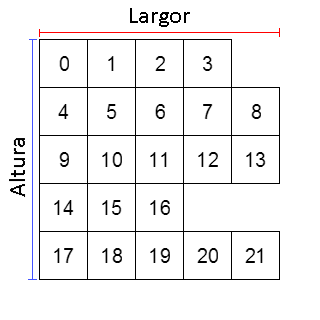

# array_length_2d

Obtiene el número de elementos de una segunda dimensión de un array bidimensional.

## Sintaxis

  
```gml  
array_length_2d(val, n);  
```  

## Argumentos

Argumento|Descripción|  
---|---|  
val|El _array_ a revisar.|  
n|El índice de la primera dimensión a revisar.|  

## Descripción

Un _array_ bidimensional posee una sola primera dimensión (altura), y una segunda dimensión por cada índice de la primera. Además, las segundas dimensiones del _array_ son independientes entre sí, y pueden tener diferentes tamaños, como se muestra en esta imagen:  
  
  
  
Es por ello que, para obtener el número de elementos de una segunda dimensión del _array_, es necesario conocer el índice de la primera en donde se encuentra. Por ejemplo, en la imagen anterior, el número de elementos que tiene la segunda dimensión del índice 0 de la primera es de 4.

## Devuelve

Número entero.

## Ejemplo

  
```gml  
a[0, 0] = 1; a[0, 1] = 2; a[0, 2] = 3; a[0, 3] = 4;  
a[1, 0] = 1; a[1, 1] = 2; a[1, 2] = 3;  
a[2, 0] = 1; a[2, 1] = 2; a[2, 2] = 3; a[2, 3] = 4; a[2, 4] = 5;  
  
h1 = array_length_2d(a, 0); //Devuelve 4.  
h2 = array_length_2d(a, 1); //Devuelve 3.  
h3 = array_length_2d(a, 2); //Devuelve 5.  
```  
Se crea un array bidimensional que posee tres elementos en la primera dimensión, y el número de elementos de las segundas dimensiones es, respectivamente, 4, 3 y 5. Posteriormente se obtienen estos números utilizando la función `array_length_2d()`.