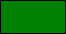
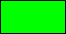

## Anexo: Constantes de color

La siguiente es una lista con todas las constantes de color predefinidas en _GameMaker: Studio_.  
  
Constante GML|Muestra de color|Valor numérico|  
---|---|---|  
c_aqua||16776960|  
c_black||0|  
c_blue||16711680|  
c_dkgray||4210752|  
c_fuchsia||16711935|  
c_gray||8421504|  
c_green||32768|  
c_lime||65280|  
c_ltgray||12632256|  
c_maroon||128|  
c_navy||8388608|  
c_olive||32896|  
c_orange||4235519|  
c_purple||8388736|  
c_red||255|  
c_silver||12632256|  
c_teal||8421376|  
c_white||16777215|  
c_yellow||65535|  
  
Por ejemplo:  
  
```gml  
draw_set_colour(c_teal);  
draw_rectangle(32, 32, 128, 128, false);  
  
```  
El anterior ejemplo dibujará un rectángulo de color `c_teal`.