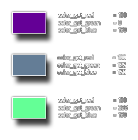

# colour_get_blue

Obtiene el componente verde de un color dado

## Sintaxis

  
```gml  
colour_get_green(col);  
```  

## Argumentos

Argumento|Descripción|  
---|---|  
col|El color al cual obtener el componente verde|  

## Descripción

Esta función devuelve la _"cantidad de verde"_ que determinado color. Este componente es un número entero de 0 a 255, donde 0 significa _"sin verde"_ y 255 _"con todo el verde"_. La siguiente imagen ilustra esto:  



## Devuelve

Entero

## Ejemplo

  
```gml  
color = c_teal;  
comp_verde = colour_get_green(color);  
```  
El código anterior obtendrá el componente verde de la constante de color `c_teal` y lo almacenará en la variable `comp_verde`.