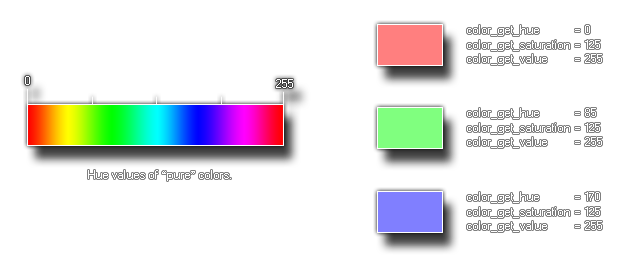

# colour_get_hue

Obtiene la matiz HSV de un color dado

## Sintaxis

  
```gml  
colour_get_hue(col);  
```  

## Argumentos

Argumento|Descripción|  
---|---|  
col|El color al cual obtener la matiz.|  

## Descripción

Esta función devuelve la _matiz_ de un color, la cual representa el color "puro" que lo forma. Este valor hace parte del modelo HSV de colores. La siguiente imagen contiene una explicación ilustrada:  



## Devuelve

Entero

## Ejemplo

  
```gml  
color = c_teal;  
hue = colour_get_hue(color);  
```  
El código anterior obtendrá la matiz de la constante de color `c_teal` y lo almacenará en la variable `hue`.