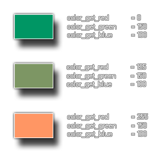

# colour_get_red

Obtiene el componente rojo de un color dado

## Sintaxis

  
```gml  
colour_get_red(col);  
```  

## Argumentos

Argumento|Descripción|  
---|---|  
col|El color al cual obtener el componente rojo|  

## Descripción

Esta función devuelve la _"cantidad de rojo"_ que determinado color. Este componente es un número entero de 0 a 255, donde 0 significa _"sin rojo"_ y 255 _"con todo el rojo"_. La siguiente imagen ilustra esto:  



## Devuelve

Entero

## Ejemplo

  
```gml  
color = c_teal;  
comp_rojo = colour_get_red(color);  
```  
El código anterior obtendrá el componente rojo de la constante de color `c_teal` y lo almacenará en la variable `comp_rojo`.