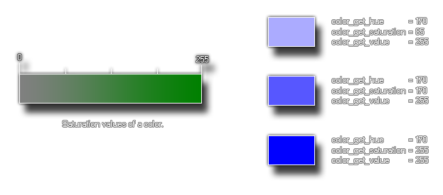

# colour_get_saturation

Obtiene la saturación HSV de un color dado

## Sintaxis

  
```gml  
colour_get_saturation(col);  
```  

## Argumentos

Argumento|Descripción|  
---|---|  
col|El color al cual obtener la saturación.|  

## Descripción

Esta función devuelve la _saturación_ de un color, la cual representa la "cantidad" de color "puro" que lo forma. Este valor hace parte del modelo HSV de colores.La siguiente imagen contiene una explicación ilustrada:  



## Devuelve

Entero

## Ejemplo

  
```gml  
color = c_teal;  
sat = colour_get_saturation(color);  
```  
El código anterior obtendrá la saturración de la constante de color `c_teal` y lo almacenará en la variable `sat`.