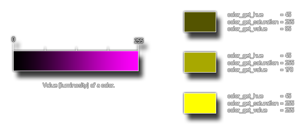

# colour_get_value

Obtiene el valor HSV de un color dado

## Sintaxis

  
```gml  
colour_get_value(col);  
```  

## Argumentos

Argumento|Descripción|  
---|---|  
col|El color al cual obtener el valor.|  

## Descripción

Esta función devuelve el _valor_ de un color, el cual representa la "luminosidad" de dicho color, siendo que 0 significa _"sin nada de luz"_ (haciéndose color negro), y 255 significa _"totalmente iluminado"_. Este valor hace parte del modelo HSV de colores.La siguiente imagen contiene una explicación ilustrada:  



## Devuelve

Entero

## Ejemplo

  
```gml  
color = c_teal;  
sat = colour_get_value(color);  
```  
El código anterior obtendrá el valor de la constante de color `c_teal` y lo almacenará en la variable `sat`.