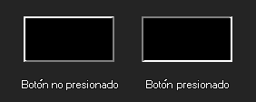

# draw_button

Dibuja un simple botón de cualquier tamaño, presionado o desprecionado.

## Sintaxis

  
```gml  
draw_button(x1, y1, x2, y2);  
```  

## Argumentos

Argumento|Descripción|  
---|---|  
x1|La coordenada en x del lado izquierdo del botón.|  
y1|La coordenada en y del lado superior del botón.|  
x2|La coordenada en x del lado derecho del botón.|  
y2|La coordenada en y del lado inferior del botón.|  
up|Indica si el boton esta desprecionado(true) o si esta presionado(false).|  

## Descripción

Esta función dibuja un simple botón rectangular usando el color y transparencia seleccionados, el argumento up define como será el efecto de los bordes, como la imagen siguiente:  


## Devuelve

Nada

## Ejemplo

  
```gml  
draw_button(100, 100, 200, 150, !mouse_check_button(mb_left));  
```  
El código anterior dibuja un botón presionado si el botón izquierdo del ratón se mantiene presionado.