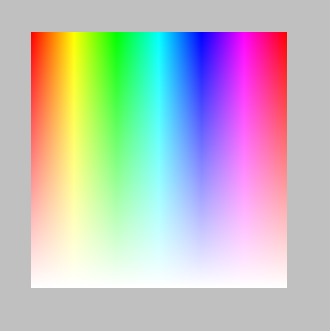

# draw_point_colour

Dibuja un pixel con un color determinado.

## Síntaxis

  
```gml  
draw_point_colour(x, y, col);  
```  

## Argumentos

Argumento|Descripción|  
---|---|  
x|La posición horizontal del pixel.|  
y|La posición vertical del pixel.|  
col|El color del pixel.|  

## Descripción

Esta función permite dibujar un simple pixel de determinado color en la posición dada. El color argumentado como parámetro tiene mayor prioridad que el definido por la función `draw_set_colour()`.

## Devuelve

Nada.

## Ejemplo

  
```gml  
for(var i = 0; i <= 255; i++)  
{  
    for(var j = 0; j <= 255; j++)  
    {  
        var color = make_colour_hsv(i, 255 - j, 255);  
        draw_point_colour(32 + i, 32 + j, color);  
    }  
}  
```  
Mediante dos ciclos anidados, se crean 2562 colores HSV y se dibuja un punto por cada color creado, resultando en una imagen similar a ésta:  
  

