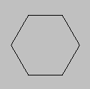

# draw_primitive_end

Finaliza el proceso de dibujo de primitivas.

## Sintaxis

  
```gml  
draw_primitive_end();  
```  

## Argumentos

Ninguno

## Descripción

Esta función debe ser llamada después de haber terminado de definir todos los puntos para la primitiva. Si esta función no es llamada, no se dibujará nada.

## Devuelve

Nada.

## Ejemplo

  
```gml  
lados = 6;  
dir = 360 / lados;  
  
draw_primitive_begin(pr_linestrip);  
for(i = 0; i <= lados; i++) {  
    lx = lengthdir_x(48, dir*i);  
    ly = lengthdir_y(48, dir*i);  
    draw_vertex(64+lx, 64+ly);  
}  
draw_primitive_end();  
```  
El anterior código permite dibujar el borde de un polígono regular de seis lados, como se muestra en la figura a continuación:  
