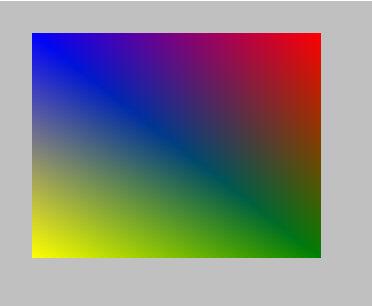

# draw_rectangle_colour

Dibuja un rectángulo con los colores dados.

## Síntaxis

  
```gml  
draw_rectangle_colour(x1, y1, x2, y2, col1, col2, col3, col4, outline);  
```  

## Argumentos

Argumento|Descripción|  
---|---|  
x1|La posición horizontal del primer punto del rectángulo|  
y1|La posición vertical del primer punto del rectángulo|  
x2|La posición horizontal del segundo punto del rectángulo.|  
y2|La posición vertical del segundo punto del rectángulo.|  
col1|El color de la ezquina superior izquierda del rectángulo.|  
col2|El color de la ezquina superior derecha del rectángulo.|  
col3|El color de la ezquina inferior derecha del rectángulo.|  
col4|El color de la ezquina inferior izquierda del rectángulo.|  
ouline.|¿Dibujar sólo el borde del rectángulo (true), o el rectángulo rellenado (false)?|  

## Descripción

 Esta función permite dibujar un rectángulo definiendo el punto perteneciente a la ezquina superior izquierda (x1, y1) y el punto perteneciente a la ezquina inferior derecha (x2, y2). Los colores argumentados tienen prioridad sobre `draw_set_colour()`, por lo que el color definido por esta función será ignorado.

## Devuelve

Nada.

## Ejemplo

  
```gml  
draw_rectangle_colour(  
    32, 32,  
    320, 256,  
    c_blue, c_red,  
    c_green, c_yellow,  
    false  
);  
```  
Se dibuja un rectángulo relleno en las coordenadas dadas, con una apariencia similar a ésta:  
  

