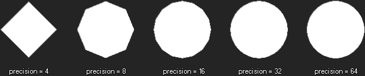

# draw_set_circle_precision

Establece la precisión del dibujado de un círculo o elipse.

## Sintaxis

  
```gml  
draw_set_circle_precision(precision);  
```  

## Argumentos

Argumento|Descripción|  
---|---|  
precision|La precisión de todos los circulos dibujados despues de llamar esta función.|  

## Descripción

Para optimizar el rendimiento al dibujar círculos, GameMaker: Studio, dibuja una forma poligonal con los suficientes lados para que parezca un círculo. Dependiendo del tamaño del círculo a dibujar, seguramente sea necesario cambiar este valor para aumentar el rendimiento o la calidad de los círculos. El argumento _precision_ indica el números de lados del polígono cuando dibuja un círculo, este número debe estar entre 4 y 64, además de ser divisible entre 4.  
El valor por defecto es 24.  


## Devuelve

Nada

## Ejemplo

  
```gml  
draw_set_circle_precision(12);  
```  
El código anterior hará que los círculos dibujados después de la función, se dibujen con polígonos de 12 lados.