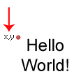
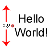
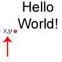

# draw_set_valign

Establece la alineación vertical del texto.

## Síntaxis

  
```gml  
draw_set_valign(valign);  
```  

## Argumentos

Argumento|Descripción|  
---|---|  
valign|La alineación vertical del texto.|  

## Descripción

Esta función se utiliza para establecer la forma en la que el texto se alinea verticalmente. Las siguientes constantes son aceptadas:  
  

Constante|Alineación|Valor numérico|  
---|---|---|  
fa_top||0|  
fa_middle||1|  
fa_bottom||2|  

## Devuelve

Nada.

## Ejemplo

  
```gml  
draw_set_colour(c_blue);  
draw_set_valign(fa_middle);  
draw_set_font(fn_Texto);  
draw_text(x, y - 64, "¡Hola a todos!");  
```  
Se establece el color azul y la fuente `fn_Texto`, y luego se dibuja un texto centrado verticalmente con estas propiedades.