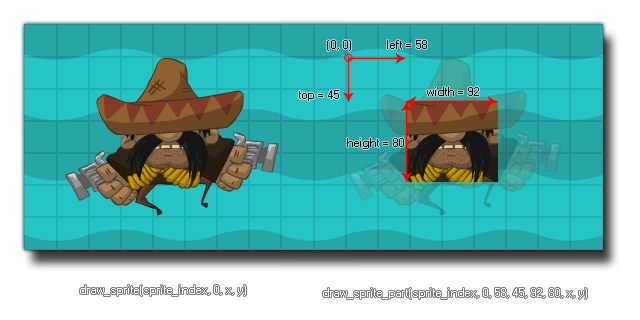

# draw_sprite_part

Dibuja una parte de un sprite en la posición dada.

## Síntaxis

  
```gml  
draw_sprite_part(sprite, subimg, left, top, width, height, x, y);  
```  

## Argumentos

Argumento|Descripción|  
---|---|  
sprite|El índice del sprite a dibujar|  
subimg|El número de la subimagen a dibujar (0 es la primera subimagen).|  
left|La posición horizontal (ezquina superior izquierda) desde donde dibujar el sprite|  
top|La posición vertical (ezquina superior izquierda) desde donde dibujar el sprite|  
width|El tamaño (horizontal) del área del sprite a dibujar|  
height|El tamaño (vertical) del área del sprite a dibujar.|  
x|La posición horizontal donde dibujar el sprite.|  
y|La posición vertical donde dibujar el sprite.|  

## Descripción

Esta función permite dibujar una parte de cualquier sprite en una posición determinada. De forma similar a `draw_sprite()`, se especifica un índice de sprite y una subimagen para dibujar. Luego, se definen las coordenadas relativas al sprite desde las que se seleccionará el área del mismo a dibujar.  
  



  
  
Cabe mencionar que si la página de textura permite cropping automático esta función podría no trabajar como se espera, pues el espacio vacío extra alrededor del sprite habrá sido removido para crear dicha página. Para resolver este problema, es necesario desactivar el cropping en Global Game Settings.  
  
**NOTA:** Cuando se dibuja un sprite con esta función, el origen del mismo será ignorado y todos valores de posición tomarán en cuenta la esquina superior izquierda de éste.  
  
**NOTA:** Esta función sólo puede usarse con sprites de mapa de bits. Sprites vectoriales o de Spine no funcionarán.

## Devuelve

Nada.

## Ejemplo

  
```gml  
draw_sprite_part(sprite_index, image_index, 4, 4, sprite_width - 8, sprite_height - 8, x, y );  
```  
Se dbujará el sprite actual de la instancia dejando un margen de cuatro pixeles en cada borde del mismo.