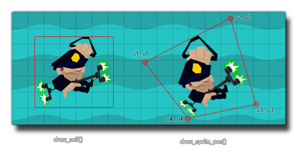

# draw_sprite_pos

Dibuja un sprite deformado mediante los cuatro puntos y la opacidad dados.

## Síntaxis

  
```gml  
draw_sprite_pos(sprite, subimg, x1, y1, x2, y2, x3, y3, x4, y4, alpha);  
```  

## Argumentos

Argumento|Descripción|  
---|---|  
sprite|El índice del sprite a dibujar.|  
subimg|El número de la subimagen del sprite a dibujar (0 es la primera).|  
x1|Componente horizontal del primer punto.|  
y1|Componente vertical del primer punto.|  
x2|Componente horizontal del segundo punto.|  
y2|Componente vertical del segundo punto.|  
x3|Componente horizontal del tercer punto.|  
y3|Componente vertical del tercer punto.|  
x4|Componente horizontal del cuarto punto.|  
y4|Componente vertical del cuarto punto.|  
alpha|La opacidad del sprite.|  

## Descripción

Esta función permite dibujar un sprite distorcionado dentro del área definida por los cuatro puntos dado. Los dos primeros argumentos son el índice del sprite y subimagen (de la misma forma que `draw_sprite()`), pero los siguientes 8 son las coordenadas que definirán los puntos que formarán el área del sprite. Estos puntos son en orden de las manecillas del reloj, ergo el primer par de coordenadas (X1,Y1) corresponden a la ezquina superior izquierda, el siguiente a la superior derecha, el siguiente a la inferior derecha y el último (X4, Y4) corresponde a la ezquina inferior izquierda. Además, es posible definir la opacidad del sprite. La siguiente imagen ilustra el comportamiento de esta función:  
  



  
  
**ALERTA:** La imagen anterior es sólo con propósitos ilustrativos, y de usarse, es posible obtener resultados distintos debido a las propiedades de la textura.  
  
 **NOTA:** Esta función sólo trabaja con sprites de mapa de bits. Los sprites vectoriales o de Spine no son admitidos.

  

## Devuelve

Nada.

## Ejemplo

  
```gml  
draw_sprite_pos(sprite_index, image_index, x - 100, y - 50, x - 50, y +150, x + 100, y + 200, x + 100, y, 1);  
```