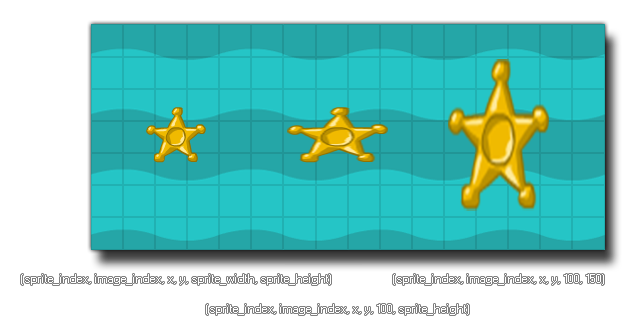

# draw_sprite_stretched

Dibuja un sprite estirado.

## Síntaxis

  
```gml  
draw_sprite_stretched(sprite, subimg, x, y, w, h);  
```  

## Argumentos

Argumento|Descripción|  
---|---|  
sprite|El índice del sprite a dibujar|  
subimg|La subimagen del sprite a dibujar (0 es la primera subimagen)|  
x|La posición horizontal donde dibujar el sprite.|  
y|La posición vertical donde dibujar el sprite.|  
w|El tamaño horizontal del sprite|  
h |El tamaño vertical del sprite.|  

## Descripción

Esta función simplemente toma un sprite y lo redimensiona al tamaño dado para dibujarlo. De igual forma a `draw_sprite()`, se especifica el sprite y la subimagen de éste que se dibujará.  
  
  



  
 **NOTA:** Cuando se dibuja un sprite con esta función, el origen del sprite es ignorado y se dibujará como si éste fuera su ezquina superior izquierda.

## Devuelve

Nada.

## Ejemplo

  
```gml  
draw_sprite_stretched(sprite_index, image_index, x, y, sprite_width / 2, sprite_height / 2);  
```  
Se dibuja el sprite actual de la instancia con la mitad de su tamaño original.