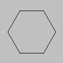

# draw_vertex

Define un vértice para una primitiva.

## Sintaxis

  
```gml  
draw_vertex(x, y);  
```  

## Argumentos

Argumento|Descripción|  
---|---|  
x|La posición horizontal del vértice.|  
y|La posición vertical del vértice.|  

## Descripción

Esta función permite definir la posición de un vértice para una primitiva. La apariencia final de la primitiva dependerá del tipo de primitiva elegido para dibujar, y el orden en el que se hayan agregado los vértices.

## Devuelve

Nada.

## Ejemplo

  
```gml  
lados = 6;  
dir = 360 / lados;  
  
draw_primitive_begin(pr_linestrip);  
for(i = 0; i <= lados; i++) {  
    lx = lengthdir_x(48, dir*i);  
    ly = lengthdir_y(48, dir*i);  
    draw_vertex(64+lx, 64+ly);  
}  
draw_primitive_end();  
```  
El anterior código permite dibujar el borde de un polígono regular de seis lados, como se muestra en la figura a continuación:  
