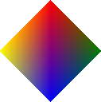

# draw_vertex_colour

Define un vértice con color y opacidad para una primitiva.

## Sintaxis

  
```gml  
draw_vertex_colour(x, y, colour, alpha);  
```  

## Argumentos

Argumento|Descripción|  
---|---|  
x|La posición horizontal en donde definir el vértice.|  
y|La posición vertical en donde definir el vértice.|  
colour|El color con el cual dibujar el vértice.|  
alpha|La opacidad del vértice.|  

## Descripción

Esta función permite definir la posición de un vértice para una primitiva, con su propia configuración de color y opacidad. La apariencia final de la primitiva depende del tipo de primitiva escogido, el orden en el cual se añaden los vértices (ver [`draw_primitive_begin()`](http://docs-gamemaker-es.blogspot.com.co/p/drawprimitivebegin.html) para más información) y el color y opacidad de los diferentes vértices, los cuales se mezclarán de forma suavizada, de uno al otro. Para finalizar el proceso y dibujar la primitiva, es necesario utilizar la función `draw_primitive_end()`.

## Devuelve

Nada.

## Ejemplo

  
```gml  
len = 64;  
  
draw_primitive_begin(pr_trianglefan);  
draw_vertex_colour(len*2, len, c_red, 1);  
draw_vertex_colour(len*3, len*2, c_green, 1)  
draw_vertex_colour(len*2, len*3, c_blue, 1);  
draw_vertex_colour(len, len*2, c_yellow, 1);  
draw_primitive_end();  
```  
El anterior código permite dibujar una primitiva cuadrilátera con 4 colores, como se muestra en la siguiente imagen:  
  
