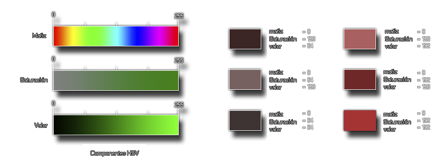

# make_colour_hsv

Devuelve un color basándose en los valores de matiz, saturación y valor.

## Sintaxis

  
```gml  
make_colour_hsv(hue, sat, val);  
```  

## Argumentos

Argumento|Descripción|  
---|---|  
hue|La matiz del color.|  
sat|La saturación del color.|  
val|¿Qué tan oscuro es el color?.|  

## Descripción

Esta función permite crear un color a partir de tres componentes: La matiz, la saturación y el _valor_, (similar a la "luminosidad"). Estos tres valores son números del 0 al 255 (más información: [**Anexo: Manejo de colores**](Anexo_manejo_de_colores.html)). A continuación una imagen ilustrativa:  
  



  
El esquema de la izquierda representa el papel que cumple cada uno de los componentes individuales, y las imágenes de la derecha son ejemplos que muestran cómo varía el resultado final a partir de variar cada componente.

## Devuelve

Número real (entero).

## Ejemplo

  
```gml  
var color = make_colour_hsv(100, 141, 230)  
```  
Se crea un color con las componentes HSV dadas y se almacena en la variable local `color`.