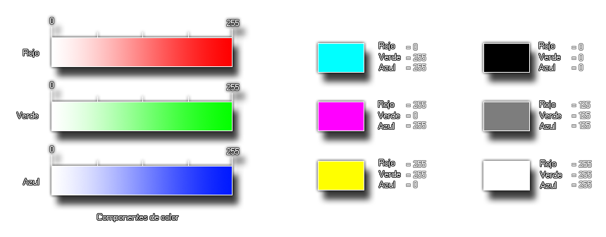

# make_colour_rgb

Devuelve un color basándose en los valores de rojo, verde y azul

## Sintaxis

  
```gml  
make_colour_rgb(r, g, b);  
```  

## Argumentos

Argumento|Descripción|  
---|---|  
r|El componente rojo del color.|  
g|El componente verde del color.|  
b|El componente azul del color.|  

## Descripción

Esta función permite crear un color a partir de tres componentes: El rojo, verde y azul del color. Estos tres valores son números del 0 al 255 (más información: [**Anexo: Manejo de colores**](Anexo_manejo_de_colores.html)). A continuación una imagen ilustrativa:  
  



  
El esquema de la izquierda representa el papel que cumple cada uno de los componentes individuales, y las imágenes de la derecha son ejemplos que muestran cómo varía el resultado final a partir de variar cada componente.

## Devuelve

Número real (entero).

## Ejemplo

  
```gml  
var color = make_colour_rgb(100, 141, 230)  
```  
Se crea un color con las componentes RGB dadas y se almacena en la variable local `color`.