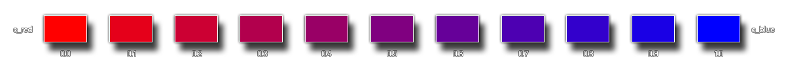

# merge_colour

Mezcla dos colores con una cantidad dada.

## Sintaxis

  
```gml  
draw_clear(col1, col2, amount);  
```  

## Argumentos

Argumento|Descripción|  
---|---|  
col1|El primer color a mezclar.|  
col2|El primer color a mezclar.|  
amount|La "cantidad" de cada color que deberá mezclarse.|  

## Descripción

Esta función toma dos colores y los mezcla para obtener así un nuevo color. La cantidad a mezclar de cada color es definida por el parámetro "amount", donde –por ejemplo– un valor de 0 devolverá exactamente el primer color (col1), un valor de 1 devolvería exactamente el segundo (col2), y un valor entre 0 y 1 devolvería la mezcla correspondiente (por ejemplo, un valor de 0.5 mezclaría ambos colores con la misma cantidad).  
  
La siguiente imagen ilustra la relación entre los valores de cantidad y la mezcla realizada:  



## Devuelve

Entero

## Ejemplo

  
```gml  
var col = merge_colour(c_lime, c_orange, 0.5)  
```  
El código anterior mezclaría el color `c_lime` con `c_orange`, ambos con la misma cantidad, y almacenaría el color resultante en la variable `col`.