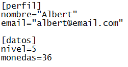

# ini_read_real

Lee un número real del archivo ini abierto actualmente.

## Sintaxis

  
```gml  
ini_read_real(section, key, def);  
```  

## Argumentos

Argumento|Descripción|  
---|---|  
section|La sección del archivo ini del cual obtener el valor.|  
key|La llave que contiene el valor.|  
def|El valor por defecto que se devolverá en caso de producirse algún error.|  

## Descripción

Un archivo ini se compone de **secciones**, y dentro de cada una de ellas se encuentran parejas **llave=valor**. Un ejemplo de la estructura de un archivo ini es el siguiente:  
  
Donde las secciones se encuentran encerradas en corchetes ([ y ]), y cada llave posee en frente suyo su respectivo valor.  
  
Esta función permite obtener un número real almacenado dentro de la sección y la llave dados. En caso de que el archivo abierto, la sección o la llave dados no existan, se devolverá el valor por defecto establecido.

## Devuelve

Número real.

## Ejemplo

  
```gml  
ini_open("datos.ini");  
monedas = ini_read_real("datos", "monedas", 0);  
nivel = ini_read_real("datos", "nivel", 1);  
ini_close();  
```  
Se abre un archivo ini, se leen algunos valores reales del archivo y posteriormente se cierra.