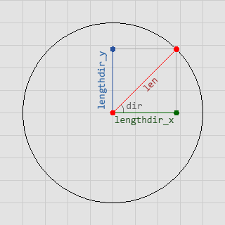

# lengthdir_x

Devuelve el componente horizontal del vector determinado por el largor y ángulo dados.

## Sintaxis

  
```gml  
lengthdir_x(len, dir);  
```  

## Argumentos

Argumento|Descripción|  
---|---|  
len|El largor del vector.|  
dir|El ángulo (en grados) del vector.|  

## Descripción

Esta función permite obtener el componente horizontal del vector que se ha determinado por el largor y ángulo argumentados. Podría expresarse como la distancia horizontal que hay entre los dos puntos que conforman dicho vector.  


## Devuelve

Número real.

## Ejemplo

  
```gml  
disx = lengthdir_x(sprite_width/2, image_angle);  
disy = lengthdir_y(sprite_width/2, image_angle);  
  
instance_create(x + disx, y + disy, obj_Bala);  
```  
El código anterior permite, en pocas palabras, crear una instancia del objeto `obj_Bala` en frente del sprite del objeto que lo ha ejecutado, tomando en cuenta la dirección del sprite.