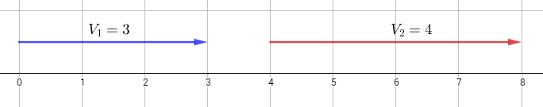
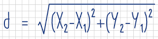

## Anexo: ¿Qué es un vector?

En muchas ocasiones, llega un punto en el que para el desarrollo de videojuegos sea necesario el uso de vectores. Éstos son ámpliamente usados en física, trigonometría y muchas otras situaciones, pero ¿qué es exactamente un vector?  
  
De forma sencilla, podemos decir que un vector es una **magnitud direccional**, que posee un determinado valor y una orientación, representado con una flecha. Comencemos hablando de lo más sencillo: los vectores de una dimensión. Estos son simplemente valores numéricos representados gráficamente de la siguiente manera:  
  

  
En esta imagen, el vector _V1_ inicia en 0 y termina en 3, teniendo un valor de 3. De la misma forma, el vector _V2_ inicia en 4 y termina en 8, teniendo un valor de 4.  
  
Es importante aclarar que no importa dónde inicia un vector; lo que importa es _qué tan largo es_ y la dirección en la que va. El vector _V2_ inicia en 4 y su largor (el valor del vector) es de 4 unidades, apuntando hacia la derecha. Este vector es idéntico a un vector que iniciara en 2 y terminara en 6, pues su largor sigue siendo el mismo, al igual que _hacia dónde va (a la derecha)_.  
  
Ahora bien, cuando se trata de números positivos, el vector –como se aprecia en la imagen anterior– se dirige "hacia la derecha"; los números negativos, por el contrario, se dirigen "hacia la izquierda". Esto significa que un vector unidimensional no es más que un número con signo (+/-). Con esto podemos entender los conceptos básicos de un vector: largor (valor) y dirección (en este caso sólo "izquierda" o "derecha").  
  
  
El ejemplo anterior es muy sencillo, pues no intervienen direcciones y se trata de una sola dimensión. Sin embargo, un vector bidimensional es algo más complejo. Podemos representarle en un plano de la siguiente manera:  
  

  
En un vector bidimensional, la dirección no es solamente "izquierda" o "derecha", o "arriba" y "abajo". La dirección de un vector se da por ún ángulo, y se forma por las coordenadas de inicio y final.  
  
Observemos el vector _V1_: Éste inicia en el punto (0, 2) y finaliza en el punto (-1, 4). Ahora bien, imaginemos que se mueve su punto de origen a (0, 0). Para obtener el punto en el que finaliza, debemos restar sus coordenadas originales, así: (_X2_ - _X1_, _Y2_ - _X1_) = (_-1 - 0_**,** _4 - 2_) = (-1, 2)...  Y, ¿qué significa esto? Significa que el vector _V1_ en la imagen es idéntico al vector que se forma desde el punto (0, 0) hasta el punto (-1, 2).  
  
Ahora, observemos el vector _V3_: Éste inicia en el punto (2, 0) y finaliza en el punto (1, 2). Hagamos lo mismo que con el anterior: movamos su origen a (0, 0) y hallemos el punto en el que finaliza: (_X2_ - _X1_, _Y2_ - _X1_) = (_1 - 2_**,** _2 -0_) = (-1, 2)... ¿Notas alguna relación? Efectivamente, el vector _V1_ y el vector _V3_ son idénticos. Esta es otra demostración de que un vector ignora la posición, sólo se compone de un valor y una dirección.  
  
Si graficáramos los tres vectores de la imagen anterior con punto de origen en (0,0), los veríamos así:  
  

  
_(Los vectores_ __V1_ y_ __V3_ están en la misma ubicación)_

  
Por último, es posible calcular el valor de un vector (qué tan largo es) partiendo de su punto de origen y de final utilizando la siguiente fórmula:  

  
Donde _d_ es el valor del vector. Por ejemplo: Hallemos el valor del vector _V2_:  
  

  
El vector _V2_ mide √5 unidades (también puede utilizarse la función `point_distance()`).