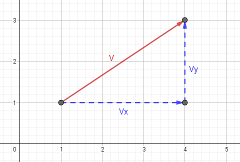
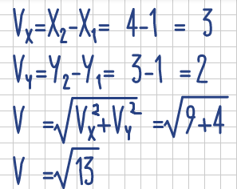
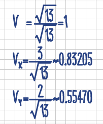
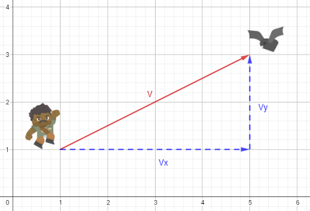

## Anexo: Vectores normalizados

Generalmente, los vectores pueden utilizarse en muchas situaciones de forma normal, pero existen ocasiones en la que es necesario regular su valor dentro de un estándar, a lo que le llamanos normalizar un vector. En escencia, no es más que un truco para convertir un vector de cualquer tamaño a uno de tamaño 1, manteniendo la dirección y las proporciones de sus componentes, los cuales tomarán un valor entre 0 y 1. Este tipo de vectores son denominados vectores unitarios.  
  



  
El primer paso para normalizar un vector _V_ es obtener su valor, al igual que el valor de sus dos componentes _Vx_ y _Vy_.  
  
  
  
Una vez obtenido el valor del vector, dividimos sus componentes por éste y decimos que el valor del vector es 1.  
  
  
  
De esta manera obtenermos las componentes del vector normalizado V.  
  
  
Una aplicación práctica podría ser calcular las componentes de la distancia entre un jugador y un enemigo, normalizar dicho vector obteniendo un valor entre 0 y 1, y multiplicando este resultado por la velocidad original del proyectil que se disparará.  
  



  
  
Para calcular los componentes de la velocidad que necesita la bala, primero debemos descomponer y normalizar el vector de distancia _V_, y después multiplicar los resultados por la velocidad original.  
  
```gml  
//Definimos los puntos del vector (coordenadas de los objetos)  
X1 = x; Y1 = y;  
X2 = enemigo.x; Y2 = enemigo.y;  
  
//Calculamos los componentes de la distancia  
Vx = X2 - X1;  
Vy = Y2 - Y1;  
  
//Calculamos el valor del vector distancia  
V = sqrt(sqr(Vx) + sqr(Vy));  
  
//Normalizamos los componentes  
Vx /= V;  
Vy /= V;  
  
velocidad = 5; //Velocidad de la bala  
  
vel_x = velocidad * Vx; //Velocidad horizontal de la bala  
vel_y = velocidad * Vy; //Velocidad vertical de la bala  
  
bala = instance_create(XY, Y1, objBala);  
bala.hspeed = vel_x;  
bala.vspeed = vel_y;  
  
```  
Este tipo de cálculos pueden simplificarse utilizando las funciones vectoriales.