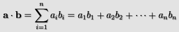
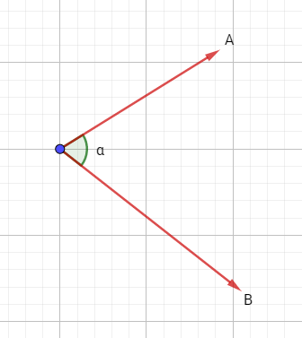
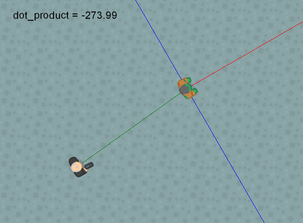

# dot_product

Devuelve el producto punto de dos vectores

## Síntaxis

  
```gml  
dot_product(x1, y1, x2, y2);  
```  

## Argumentos

Argumento|Descripción|  
---|---|  
x1|El componente horizontal del primer vector.|  
y1|El componente vertical del primer vector.|  
x2|El componente horizontal del segundo vector.|  
y2|El componente vertical del segundo vector.|  

## Descripción

El producto punto es un valor que expresa la relación angular entre dos vectores. Es llamado así por el símbolo que lo representa, el punto medio. Es decir, el producto punto entre A y B se escribe como: A · B.  
  
Matemáticamente, la fórmula del producto punto se escribe así:  
  



  
Donde n es el número de dimensiones que poseen los vectores, e i representa cada componente en las dimensiones de éstos.  
  
Teniendo en cuenta lo anterior, en un plano 2D el producto punto se calcula así:  
  
```gml  
A · B = (Ax *  Bx) + (Ay *  By)  
  
```  
Sin embargo, hay algo curioso con el producto punto, y es que también puede expresarse de esta manera:  
  
```gml  
A · B = (tamaño de A) * (tamaño de B) * cos(α)  
  
```  
Donde α representa el ángulo que se forma entre los vectores A y B, como se muestra en la siguiente imagen:  
  



  
Algo importante a mencionar, es que el producto punto de dos vectores posee ciertas características de gran utilidad:  

1.  Si A y B son perpendiculares (es decir, forman un ángulo de 90°), el producto punto será 0, pues cos(90°) = 0.
2.  Si α es menor a 90°, el producto punto será positivo, al igual que cos(α).
3.  Si α es mayor a 90°, el producto punto será negativo, al igual que cos(α).

## Devuelve

Número real.

## Ejemplo

Veamos una aplicación del producto punto en un videojuego. Observemos la siguiente imagen animada:  
  



  
La línea roja representa el ángulo del enemigo, la línea verde representa el vector entre el jugador y el enemigo, y la línea azul representa el área de visibilidad del enemigo (perpendicular al ángulo de éste). Para calcular si el jugador se encuentra dentro del área de visibilidad del enemigo, podemos usar el siguiente código:  
  
```gml  
//Obtenemos el vector entre el jugador y el enemigo  
var x1 = oPlayer.x - x;  
var y1 = oPlayer.y - y;  
  
//Obtenemos el vector normal de la dirección del enemigo.  
var x2 = lengthdir_x(1, image_angle);  
var y2 = lengthdir_y(1, image_angle);  
  
var dot = dot_product(x1, y1, x2, y2); //Calculamos el producto punto  
  
/*  
El producto será mayor que 0 (positivo) si el ángulo que  
forma el vector entre el jugador y el enemigo, y el vector  
normal del ángulo del enemigo es menor de 90°. De lo contrario,  
devolverá negativo o 0 en caso de ser perpendiculares.  
*/  
if(dot > 0)  
{  
    //El enemigo puede ver al jugador  
    draw_text(x, y - 64, "¡Puedo verte!");  
}  
  
```