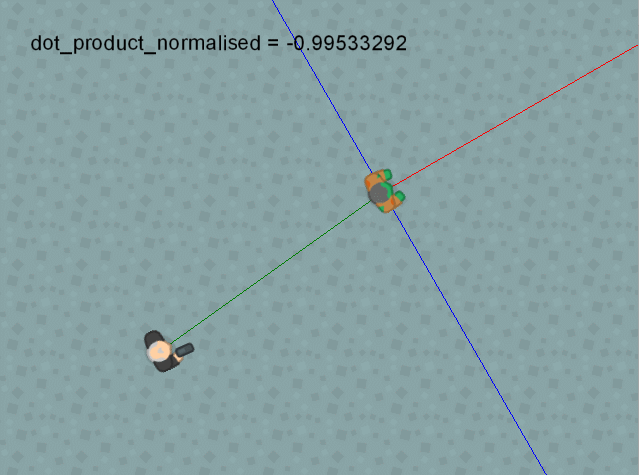

# dot_product_normalised

Devuelve el producto punto de dos vectores

## Síntaxis

  
```gml  
dot_product_normalised(x1, y1, x2, y2);  
```  

## Argumentos

Argumento|Descripción|  
---|---|  
x1|El componente horizontal del primer vector.|  
y1|El componente vertical del primer vector.|  
x2|El componente horizontal del segundo vector.|  
y2|El componente vertical del segundo vector.|  

## Descripción

Esta función es exactamente igual a `dot_product()`, con la única diferencia de que el valor que devuelve es ajustado para estar entre -1 y 1.  
  
Como esta función puede devolver números con muchas cifras decimales (cifras que son importantes), debe tenerse en cuenta la precisión de los números que se está utilizando (`math_get_epsilon()`).

## Devuelve

Número real.

## Ejemplo

Veamos una aplicación del producto punto en un videojuego. Observemos la siguiente imagen animada:  
  



  
La línea roja representa el ángulo del enemigo, la línea verde representa el vector entre el jugador y el enemigo, y la línea azul representa el área de visibilidad del enemigo (perpendicular al ángulo de éste).  
  
Para calcular si el jugador se encuentra dentro del área de visibilidad del enemigo, podemos usar el siguiente código:  
  
```gml  
//Obtenemos el vector entre el jugador y el enemigo  
var x1 = oPlayer.x - x;  
var y1 = oPlayer.y - y;  
  
//Obtenemos el vector normal de la dirección del enemigo.  
var x2 = lengthdir_x(1, image_angle);  
var y2 = lengthdir_y(1, image_angle);  
  
var dot = dot_product_normalised(x1, y1, x2, y2); //Calculamos el producto punto  
  
/*  
El producto será mayor que 0 (positivo) si el ángulo que  
forma el vector entre el jugador y el enemigo, y el vector  
normal del ángulo del enemigo es menor de 90°. De lo contrario,  
devolverá negativo o 0 en caso de ser perpendiculares.  
*/  
if(dot > 0)  
{  
    //El enemigo puede ver al jugador  
    draw_text(x, y - 64, "¡Puedo verte!");  
}  
  
```