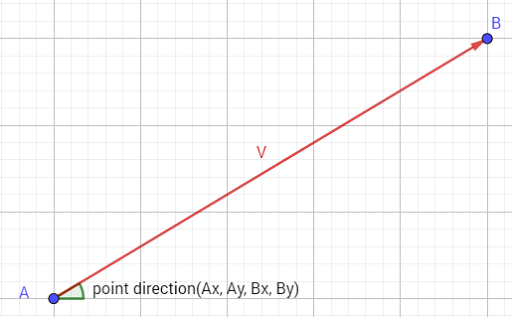

# point_direction

Obtiene el ángulo (en grados) del vector dado.

## Sintaxis

  
```gml  
point_direction(x1, y1, x2, y2);  
```  

## Argumentos

Argumento|Descripción|  
---|---|  
x1|La componente horizontal del primer punto del vector.|  
y1|La componente vertical del primer punto del vector.|  
x2|La componente horizontal del segundo punto del vector.|  
y2|La componente vertical del segundo punto del vector.|  

## Descripción

Esta función devuelve la dirección del vector formado por los puntos especificados (x1, y1) y (x2, y2) en relación con las coordenadas fijas de la sala, como se aprecia en la siguiente imagen:  
  



## Devuelve

Número real.

## Ejemplo

  
```gml  
var angulo = point_direction(x, y, enemigo.x, enemigo.y);  
with(instance_create(x, y, oBala))  
{  
    direction = angulo;  
    speed = 20;  
}  
  
```  
Se obtiene el ángulo que hay entre el objeto actual y el objeto _enemigo_, y posteriormente se crea una bala que irá en dicha dirección con una velocidad de 20_px/step_.