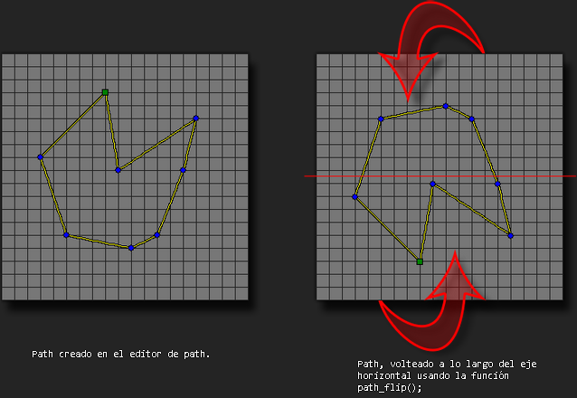

# path_flip

Voltea el path dado a lo largo de eje horizontal, desde su centro.

## Sintaxis

  
```gml  
path_flip(index);  
```  

## Argumentos

Argumento|Descripción|  
---|---|  
index|El índice del path a voltear.|  

## Descripción

Esta función toma todos los puntos de un path y los voltea con respecto a su eje horizontal. Esto cambia los datos del path que usan las instancias de forma permanente desde que inicia el juego hasta que termina.  
  



## Devuelve

Nada

## Ejemplo

  
```gml  
path_flip(mypath);  
```  
El código anterior volteara "mypath" a lo largo del eje horizontal