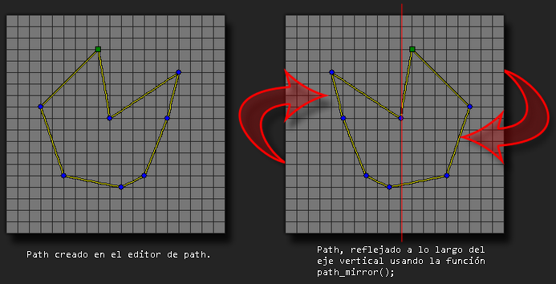

# path_mirror

Refleja el path dado a lo largo de eje vertical, desde su centro.

## Sintaxis

  
```gml  
path_mirror(index);  
```  

## Argumentos

Argumento|Descripción|  
---|---|  
index|El índice del path a reflejar.|  

## Descripción

La función toma todos los puntos del path y los refleja por el centro a lo largo del eje vertical. Esta función cambia los datos del path que usan las instancias permanentemente desde que la función es utilizada hasta el final del juego.  
  



## Devuelve

Nada

## Ejemplo

  
```gml  
path_mirror(mypath);  
```  
El código anterior refleja "mypath" a lo largo del eje vertical.