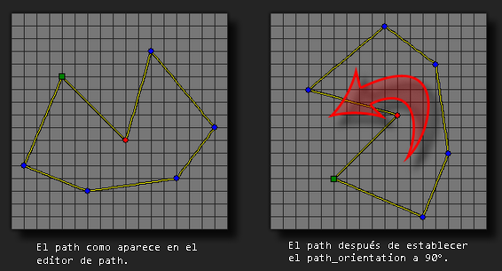

# path_orientation

Establece la orientación del path.

## Sintaxis

  
```gml  
path_orientation;  
```  

## Argumentos

Ninguno  

## Descripción

Esta variable mantiene la actual orientación del path. Cuando un path es creado, su orientación por defecto es 0 grados, pero puede cambiar este valor al que desee utilizar. Recuerde que en GameMaker: Studio (sin usar físicas) los ángulos se calculan al contrario de las agujas del reloj, por lo que establecer la orientación del path en 90, girará el path actual hacia la izquierda.  
  



## Devuelve

Número real

## Ejemplo

  
```gml  
mypath = path_duplicate(choose(path_1, path_2, path_3, path_4));  
path_orientation = 90;  
```  
El código anterior duplica un path aleatorio, pre-hecho, en la variable "mypath". Este nuevo path se girará 90 grados.