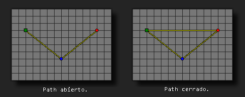

# path_set_closed

Establece si el path dado es cerrado o abierto.

## Sintaxis

  
```gml  
path_set_closed(index, closed);  
```  

## Argumentos

Argumento|Descripción|  
---|---|  
index|El índice del path a modificar.|  
closed|Indica si el path es cerrado(true) o no(false).|  

## Descripción

Esta función puede ser usada para establecer si el path dado es abierto(false) o cerrado(true). Un path cerrado tiene conectado el punto inicial con el punto final, formando un bucle; y un path abierto tiene un comienzo y un final definidos. Esta función cambia los datos del path de forma permanente desde que se usa la función hasta el final del juego, por lo que todas las instancias que usen el path se verán afectadas.  
  



## Devuelve

Nada

## Ejemplo

  
```gml  
path_set_closed(path0, true);  
```  
El código anterior establece el path indexado en "path0" como un path cerrado.