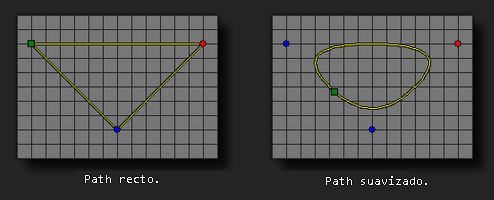

# path_set_kind

Establece el tipo de conexiones del path dado.

## Sintaxis

  
```gml  
path_set_kind(index, val);  
```  

## Argumentos

Argumento|Descripción|  
---|---|  
index|El índice del path a modificar.|  
val|El tipo del path, 0 para recto y 1 para suavizado.|  

## Descripción

Esta función puede ser usada para establecer el tipo de conexiones de un path en especifico. Estas pueden ser lineas rectas (colocándolo en 0) o pueden ser suavizadas (colocándolo en 1), se debe de tener en cuenta la precisión del path (la precisión puede ser establecida con la función `path_set_precision`). Esta función modifica los datos del path desde que se usa la función hasta que termina el juego, por lo que todas las instancias que usen el path se verán afectadas.  
  



## Devuelve

Nada

## Ejemplo

  
```gml  
path_set_kind(path0, 1);  
```  
El código anterior establece path0 como un path suavizado.