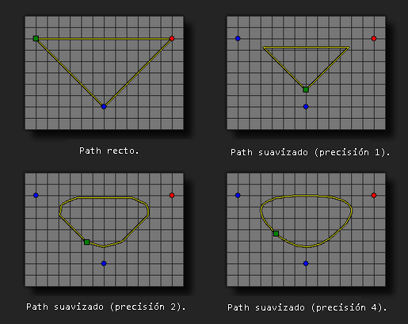

# path_set_precision

Establece la precisión del path dado.

## Sintaxis

  
```gml  
path_set_precision(index, prec);  
```  

## Argumentos

Argumento|Descripción|  
---|---|  
index|El índice del path a modificar.|  
prec|La precisión del path. Este es un entero entre 1 y 8.|  

## Descripción

Con esta función puede establecer que tan "suavizado" será el path. Este valor está entre 1 y 8, con un valor bajo hará bordes rectos con curvas más redondeadas entre los puntos; con un valor alto redondeará todos los puntos teniendo un path más curvilíneo. Tenga en cuenta que la función no tendrá efecto si el path no es establecido como suavizado con la función `path_set_kind()`. Esta función cambia los datos del path desde que es usada hasta el final del juego, por lo que todas las instancias que usen el path se verán afectadas.  
  



## Devuelve

Nada

## Ejemplo

  
```gml  
path_set_precision(path0, 2);  
```  
El código anterior establece al path0 una precisión de 2.